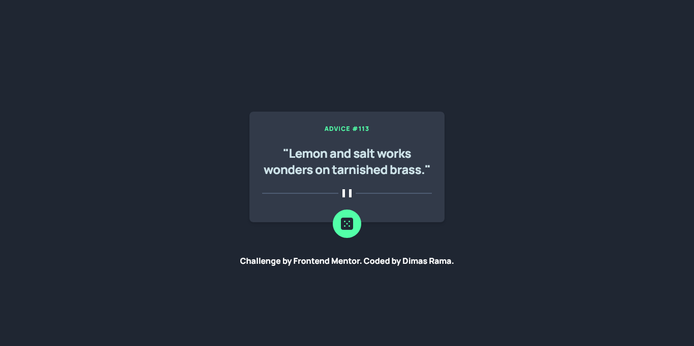
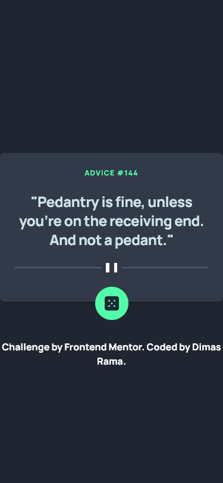

# Frontend Mentor - Advice generator app solution

This is a solution to the [Advice generator app challenge on Frontend Mentor](https://www.frontendmentor.io/challenges/advice-generator-app-QdUG-13db). Frontend Mentor challenges help you improve your coding skills by building realistic projects.

## Table of contents

- [Overview](#overview)
  - [The challenge](#the-challenge)
  - [Screenshots](#screenshot)
  - [Links](#links)
- [My process](#my-process)
  - [Built with](#built-with)
  - [What I learned](#what-i-learned)
  - [Useful resources](#useful-resources)
- [Author](#author)
- [Acknowledgments](#acknowledgments)

**Note: Delete this note and update the table of contents based on what sections you keep.**

## Overview

### The challenge

Users should be able to:

- View the optimal layout for the app depending on their device's screen size
- See hover states for all interactive elements on the page
- Generate a new piece of advice by clicking the dice icon

### Screenshot





### Links

- Solution URL: [Solution Site](https://www.frontendmentor.io/solutions/advice-generator-using-tailwind-css-ilN5HX3V6h)
- Live Site URL: [Live Site](https://ramawib.github.io/advice-generator-app-main/)

## My process

### Built with

- Semantic HTML5 markup
- Tailwind CSS
- Flexbox
- Javascript
- Flowbite (Tailwind CSS Component Library)
- Mobile-first workflow

### What I learned

In this project, I applied my knowledge on fetching data with fetch(). I also learned to use Tailwind CSS and modify some template from a Tailwind CSS component library, Flowbite. I learned that I don't always have to build anything from scratch and reinvent the wheel everytime. Utilizing Tailwind CSS and Flowbite has fasten up my coding process.

The Javascript code that I'm proud of:

```js
const fetchAdvice = fetch('https://api.adviceslip.com/advice?t=' + Math.random()).then(response => response.json()).then(data => {
    adviceText.innerHTML = `"${data.slip.advice}"`;
    adviceID.innerHTML = `advice #${data.slip.id}`
});
```

### Useful resources

- [Tailwind CSS](https://tailwindcss.com) - This helped me to easily modify components because it's a utility-first framework. I really liked this framework and will use it going forward.
- [Flowbite](https://flowbite.com) - Tailwind CSS component library. Very useful and easy to modify. I usually use Flowbite, DaisyUI, or HyperUI
- [Stackoverflow](https://stackoverflow.com/questions/71255840/fetch-api-return-same-data-always) - This website is no doubt should be in programmer Maslow's Hierarchy of Needs. A Stackoverflow user by the name of "jfriend00" provided the answer being asked by a fellow programmer "Yunus Emre Arslan" which happens to be a problem of mine as well.

## Author

- Website - [Dimas Rama](https://ramawib.github.io)
- Frontend Mentor - [@ramawib](https://www.frontendmentor.io/profile/ramawib)
- Twitter - [@ramawib](https://www.twitter.com/ramawib)
- Instagram - [@ramawib](https://www.instagram.com/ramawib)

## Acknowledgments

Thanks to user Yunus Emre Arslan for asking the question on Stackoverflow and user jfriend00 for providing the solution to the question!
